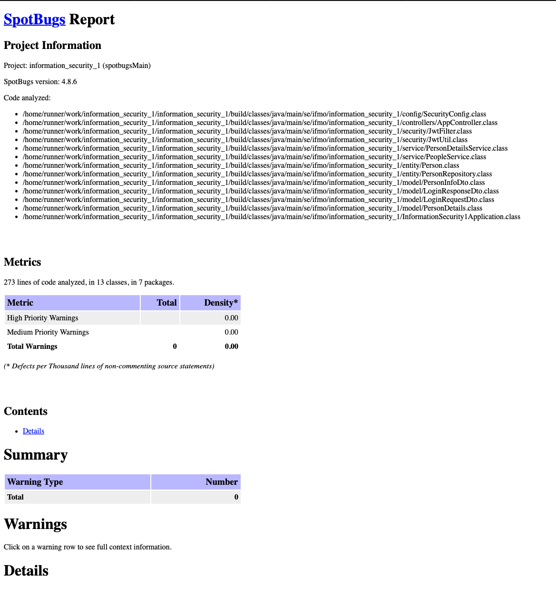
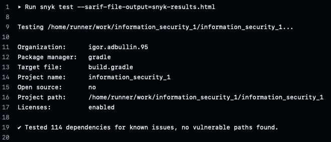

# information-security-lab-1
Разработка безопасного backend приложения с автоматизированной проверкой кода на уязвимости.

## Инструкция для запуска

```bash
./gradlew build

docker-compose up --build
```

## API Endpoints

### 1. Аутентификация

**POST /auth/login** - Аутентификация пользователя
```bash
curl -X POST http://localhost:8080/auth/login \
  -H "Content-Type: application/json" \
  -d '{"username":"default","password":"pass"}'
```

**Response:**
```json
{
  "accessToken": "eyJhbGciOiJIUzI1NiIs..."
}
```

### 2. Список пользователй

**GET /api/data** - Получениие списка пользователей (требует аутентификации)
```bash
curl -X GET http://localhost:8080/api/data \
  -H "Authorization: Bearer {{ jwt_token }}"
```

**Response:**
```json
[
  {
    "username": "default"
  },
  {
    "username": "default2"
  }
]
```


### 3. Профиль пользователя

**GET /api/profile** - Получение профиля (требует аутентификации)
```bash
curl -X GET http://localhost:8080/api/profile \
  -H "Authorization: Bearer {{ jwt_token }}"
```

**Response:**
```json
{
  "username": "default"
}
```

## Реализованные меры защиты

### 1. Защита от SQL Injection (SQLi)

**Технология:** Spring Data JPA - фреймворк на базе ORM

**Реализация:**
- Использование Spring Data JPA вместо raw SQL
- Валидация входных данных на уровне моделей
- Check constraints в базе данных

**Код:**
```java
@Repository
public interface PersonRepository extends JpaRepository<Person, Integer> {

    Optional<Person> findByUsername(String username);
}
```

### 2. Защита от XSS (Cross-Site Scripting)

**Технология:** HTML escaping

**Реализация:**
- Экранирование всех пользовательских данных в ответах API

**Код:**
```java
 return isNull(username) ? null : HtmlUtils.htmlEscape(username);
```

### 3. Безопасная аутентификация

**Технология:** JWT, bcrypt, Spring Security

**Реализация:**
- **Хэширование паролей:** bcrypt
- **JWT токены:** Access (15 мин)
- Аутентификация с помощью org.springframework.security.AuthenticationManager

**Код:**
```java
private Person toModel(String username, String password) {
    return new Person(passwordEncoder.encode(password), username);
}
```

## 📊 CI/CD Pipeline & Security Scanning


### Spotbugs SAST Report


### Safety Report
